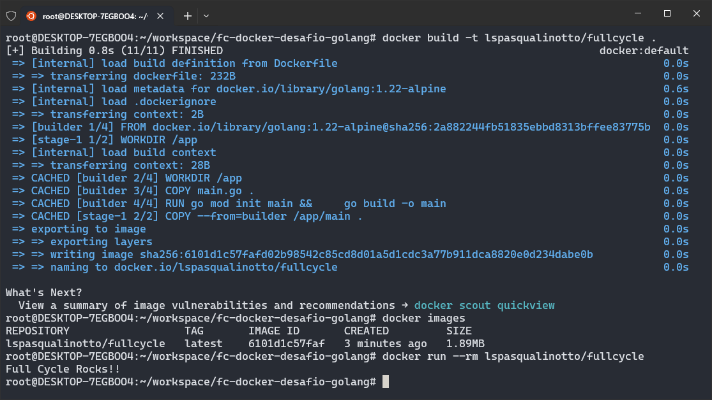

# 🐋 Docker: Desafio Golang | Full Cycle
Repositório do desafio "Go com Docker" do curso Full Cycle

## 📄 Instruções
Deve ser realizado o print da mensagem <b>Full Cycle Rocks!!</b> ao executar o comando abaixo.

```bash
docker run <seu-user>/fullcycle
```

O tamanho da imagem deve ser menor do que **2MB**.

## 🛠 Execução
Execute o comando abaixo.

```bash
docker run --rm lspasqualinotto/fullcycle
```

## 🖼️ Evidência


## 🔗 Links
- [Imagem no Docker Hub](https://hub.docker.com/repository/docker/lspasqualinotto/fullcycle/general)